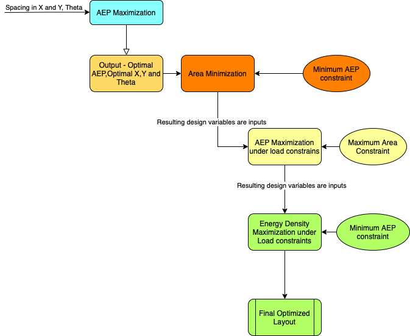

# Master_Thesis
A thesis on wind farm layout optimization to maximize annual energy production and energy density under fatigue load constraints. The thesis comprises two case studies: one with a fictional wind farm layout and the other with an actual wind farm layout. The process flow chart for the two studies is below:

